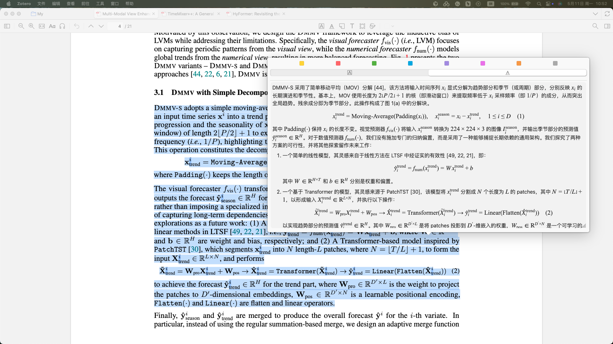

# Translate for Zotero (Markdown 增强版)

> **⚠️ 特别声明 / Acknowledgment**
> 
> 本项目是基于优秀开源项目 [windingwind/zotero-pdf-translate](https://github.com/windingwind/zotero-pdf-translate) 的 **v2.4.4** 版本进行修改和二次开发的定制版本。
> 原项目作者为该插件贡献了不可磨灭的底层架构和强大的多引擎翻译能力，在此向原作者表示最诚挚的感谢！

---

## ✨ 新增核心特性：全场景 Markdown 与 LaTeX 混合渲染



在学术研究中，我们经常使用 GPT-4o、Claude 3.5 等强大的大语言模型（LLM）作为翻译或总结引擎。这些模型通常会输出带有丰富格式的 Markdown 文本（如标题、列表、代码块、表格等）。原版插件仅支持纯文本显示，导致大段的排版粘连在一起，难以阅读。

此增强版插件在原版基础上，引入了完整的 **Markdown 富文本渲染引擎**，并完美兼容了原有的 **LaTeX 数学公式渲染**功能。

### 💡 实现原理

1. **底层引擎集成**：
   - 引入了轻量级且高性能的 Markdown 解析库 `marked.js`。
   - 专门编写了 `markdownRenderer.ts` 来统筹普通的 Markdown 节点和学术公式节点。

2. **智能公式保护机制 (Math Protection)**：
   - Markdown 解析器（如将 `_` 解析为斜体）经常会与 LaTeX 公式语法（如下标 `x_1`）发生灾难性冲突。
   - 本插件实现了一套**“占位符保护机制”**：在进行 Markdown 解析之前，系统会使用正则预先提取出所有的 LaTeX 公式块，并替换为安全的隐形占位符；待 Markdown 整体排版完成后，再将公式安全的渲染并填回原位。从而实现了真正的“图文并茂、公式不乱”。

3. **原生级别的 UI 交互**：
   - **侧边栏 (Sidebar)** 与 **独立窗口 (Standalone)**：翻译结果直接以富文本展示，支持深/浅色模式自适应。
   - **PDF 划词悬浮窗 (Reader Popup)**：
     - **动态尺寸计算**：悬浮窗会在后台计算纯文本的完美尺寸，并将其精确套用在富文本面板上。
     - **防遮挡与防溢出**：对超长文本进行了严格的屏幕占比限制（MaxHeight 60%），并加入了双向（上下）屏幕边缘碰撞检测，确保弹窗像不倒翁一样始终保持在可视区域内，绝不遮挡原文，并在需要时平滑唤出滚动条。
     - **无缝切换**：在阅读弹窗中，只需轻轻点击（防误触设计：不影响拖拽滚动和文字复制），即可瞬间切换回原始的纯文本编辑框，方便进行复制或内容微调；点击缩放手柄可自由调整窗口大小。

---

## 🚀 如何使用 Markdown 渲染功能

1. **安装插件**：
   - 本项目已将编译好的安装包包含在源码中。你可以在项目根目录的 `build/translate-for-zotero.xpi` 找到它（当然，你也可以通过源码自行编译）。
   - 在 Zotero 中点击菜单栏 `工具` -> `附加组件` -> 右上角齿轮 ⚙️ -> `从文件安装附加组件...`。
   - 安装完成后，请务必 **重启 Zotero**。

2. **开启渲染**：
   - 在 Zotero 中依次点击：`编辑` (或 Mac 下的 Zotero 菜单) -> `设置 (Settings)`。
   - 找到左侧的 `Translate for Zotero` 选项卡。
   - 切换到 **`用户界面 (User Interface)`** 栏目。
   - 勾选 **“条目面板区块：在翻译中渲染 Markdown”**（建议同时勾选上方的“在翻译中渲染 LaTeX 公式”）。

3. **最佳实践建议**：
   - 在配置 OpenAI、Gemini、Claude 等大模型自定义提示词（Prompt）时，建议加上一句：`"请使用清晰的 Markdown 格式输出翻译/总结结果"`，以获得最佳的排版体验。

---

## 🛠 源码编译指南

如果你需要基于此增强版继续开发，可以参考以下步骤：

1. 确保安装了 `Node.js` (推荐 v18+)。
2. 在项目根目录下执行安装依赖：
   ```bash
   npm install
   ```
3. 执行编译打包：
   ```bash
   npm run build
   ```
4. 编译成功后，生成的插件包位于：`build/translate-for-zotero.xpi`。

---

*再次感谢 [windingwind/zotero-pdf-translate](https://github.com/windingwind/zotero-pdf-translate) 提供的强大基石！*